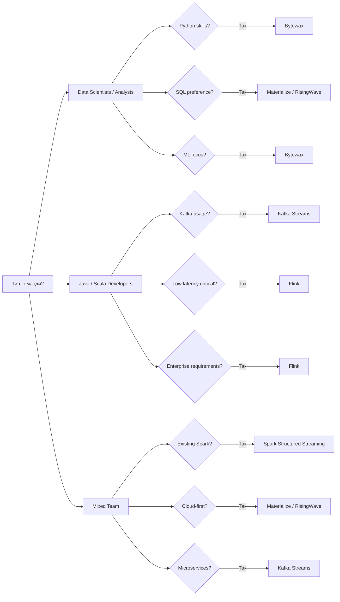

- [[#📊 Швидкий огляд технологій|📊 Швидкий огляд технологій]]
- [[#🏗️ Архітектурні позиції в системі|🏗️ Архітектурні позиції в системі]]
	- [[#🏗️ Архітектурні позиції в системі#1. Real-time ETL Pipeline|1. Real-time ETL Pipeline]]
	- [[#🏗️ Архітектурні позиції в системі#2. Event-driven Architecture|2. Event-driven Architecture]]
	- [[#🏗️ Архітектурні позиції в системі#3. ML Feature Pipeline|3. ML Feature Pipeline]]
	- [[#🏗️ Архітектурні позиції в системі#4. Real-time Analytics|4. Real-time Analytics]]
	- [[#🏗️ Архітектурні позиції в системі#5. Complex Event Processing|5. Complex Event Processing]]
- [[#📋 Детальний аналіз технологій|📋 Детальний аналіз технологій]]
	- [[#📋 Детальний аналіз технологій#1. Apache Spark Structured Streaming|1. Apache Spark Structured Streaming]]
		- [[#1. Apache Spark Structured Streaming#Що це?|Що це?]]
		- [[#1. Apache Spark Structured Streaming#Ключові характеристики|Ключові характеристики]]
		- [[#1. Apache Spark Structured Streaming#Переваги|Переваги]]
		- [[#1. Apache Spark Structured Streaming#Недоліки|Недоліки]]
		- [[#1. Apache Spark Structured Streaming#Продуктивність (benchmarks 2025)|Продуктивність (benchmarks 2025)]]
		- [[#1. Apache Spark Structured Streaming#Рекомендації застосування|Рекомендації застосування]]
	- [[#📋 Детальний аналіз технологій#2. Apache Flink|2. Apache Flink]]
		- [[#2. Apache Flink#Що це?|Що це?]]
		- [[#2. Apache Flink#Ключові характеристики|Ключові характеристики]]
		- [[#2. Apache Flink#Нові можливості Flink 1.19+ (2025)|Нові можливості Flink 1.19+ (2025)]]
		- [[#2. Apache Flink#Переваги|Переваги]]
		- [[#2. Apache Flink#Недоліки|Недоліки]]
		- [[#2. Apache Flink#Продуктивність (benchmarks 2025)|Продуктивність (benchmarks 2025)]]
		- [[#2. Apache Flink#Рекомендації застосування|Рекомендації застосування]]
	- [[#📋 Детальний аналіз технологій#3. Kafka Streams|3. Kafka Streams]]
		- [[#3. Kafka Streams#Що це?|Що це?]]
		- [[#3. Kafka Streams#Ключові характеристики|Ключові характеристики]]
		- [[#3. Kafka Streams#Переваги|Переваги]]
		- [[#3. Kafka Streams#Недоліки|Недоліки]]
		- [[#3. Kafka Streams#Продуктивність (benchmarks 2025)|Продуктивність (benchmarks 2025)]]
		- [[#3. Kafka Streams#Рекомендації застосування|Рекомендації застосування]]
	- [[#📋 Детальний аналіз технологій#4. Bytewax|4. Bytewax]]
		- [[#4. Bytewax#Що це?|Що це?]]
		- [[#4. Bytewax#Ключові характеристики|Ключові характеристики]]
		- [[#4. Bytewax#Нові можливості (2025)|Нові можливості (2025)]]
		- [[#4. Bytewax#Переваги|Переваги]]
		- [[#4. Bytewax#Недоліки|Недоліки]]
		- [[#4. Bytewax#Продуктивність (benchmarks 2025)|Продуктивність (benchmarks 2025)]]
		- [[#4. Bytewax#Рекомендації застосування|Рекомендації застосування]]
	- [[#📋 Детальний аналіз технологій#5. Materialize|5. Materialize]]
		- [[#5. Materialize#Що це?|Що це?]]
		- [[#5. Materialize#Ключові характеристики|Ключові характеристики]]
		- [[#5. Materialize#Нові можливості (2025)|Нові можливості (2025)]]
		- [[#5. Materialize#Переваги|Переваги]]
		- [[#5. Materialize#Недоліки|Недоліки]]
		- [[#5. Materialize#Продуктивність (benchmarks 2025)|Продуктивність (benchmarks 2025)]]
		- [[#5. Materialize#Рекомендації застосування|Рекомендації застосування]]
	- [[#📋 Детальний аналіз технологій#6. RisingWave|6. RisingWave]]
		- [[#6. RisingWave#Що це?|Що це?]]
		- [[#6. RisingWave#Ключові характеристики|Ключові характеристики]]
		- [[#6. RisingWave#Переваги|Переваги]]
		- [[#6. RisingWave#Недоліки|Недоліки]]
- [[#📊 Детальне порівняння продуктивності|📊 Детальне порівняння продуктивності]]
	- [[#📊 Детальне порівняння продуктивності#Таблиця продуктивності|Таблиця продуктивності]]
	- [[#📊 Детальне порівняння продуктивності#Таблиця операційної складності|Таблиця операційної складності]]
- [[#🎯 Framework для прийняття рішення|🎯 Framework для прийняття рішення]]
	- [[#🎯 Framework для прийняття рішення#Decision Tree|Decision Tree]]
	- [[#🎯 Framework для прийняття рішення#Матриця вибору за вимогами|Матриця вибору за вимогами]]
- [[#🏢 Real-world Use Cases|🏢 Real-world Use Cases]]
	- [[#🏢 Real-world Use Cases#Фінансові сервіси|Фінансові сервіси]]
	- [[#🏢 Real-world Use Cases#E-commerce платформи|E-commerce платформи]]
	- [[#🏢 Real-world Use Cases#IoT та Telemetry|IoT та Telemetry]]
	- [[#🏢 Real-world Use Cases#Real-time Analytics|Real-time Analytics]]
- [[#🚀 Нові та альтернативні технології (2025)|🚀 Нові та альтернативні технології (2025)]]
	- [[#🚀 Нові та альтернативні технології (2025)#Специалізовані Stream Processors|Специалізовані Stream Processors]]
	- [[#🚀 Нові та альтернативні технології (2025)#Emerging Technologies|Emerging Technologies]]
- [[#🔄 Migration Strategies|🔄 Migration Strategies]]
	- [[#🔄 Migration Strategies#Від Batch до Streaming|Від Batch до Streaming]]
	- [[#🔄 Migration Strategies#Legacy Spark Streaming → Structured Streaming|Legacy Spark Streaming → Structured Streaming]]
	- [[#🔄 Migration Strategies#Monolith → Microservices Streaming|Monolith → Microservices Streaming]]
- [[#🛠️ Operational Considerations|🛠️ Operational Considerations]]
	- [[#🛠️ Operational Considerations#Monitoring та Observability|Monitoring та Observability]]
	- [[#🛠️ Operational Considerations#Security та Compliance|Security та Compliance]]
	- [[#🛠️ Operational Considerations#Cost Optimization|Cost Optimization]]
- [[#💰 Total Cost of Ownership|💰 Total Cost of Ownership]]
- [[#💡 Практичні архітектури|💡 Практичні архітектури]]
	- [[#💡 Практичні архітектури#Архітектура 1: E-commerce Recommendations|Архітектура 1: E-commerce Recommendations]]
	- [[#💡 Практичні архітектури#Архітектура 2: Financial Fraud Detection|Архітектура 2: Financial Fraud Detection]]
	- [[#💡 Практичні архітектури#Архітектура 3: IoT Data Pipeline|Архітектура 3: IoT Data Pipeline]]
	- [[#💡 Практичні архітектури#Архітектура 4: Real-time Analytics Dashboard|Архітектура 4: Real-time Analytics Dashboard]]
- [[#🔮 Майбутні тенденції (2025-2027)|🔮 Майбутні тенденції (2025-2027)]]
	- [[#🔮 Майбутні тенденції (2025-2027)#**Serverless Streaming**|**Serverless Streaming**]]
	- [[#🔮 Майбутні тенденції (2025-2027)#**AI-Enhanced Stream Processing**|**AI-Enhanced Stream Processing**]]
	- [[#🔮 Майбутні тенденції (2025-2027)#**Real-time Feature Stores**|**Real-time Feature Stores**]]
	- [[#🔮 Майбутні тенденції (2025-2027)#**Edge Computing Integration**|**Edge Computing Integration**]]
- [[#🏆 Фінальні рекомендації|🏆 Фінальні рекомендації]]
	- [[#🏆 Фінальні рекомендації#За типом організації|За типом організації]]
	- [[#🏆 Фінальні рекомендації#USE CASE|USE CASE]]
	- [[#🏆 Фінальні рекомендації#Загальні принципи вибору|Загальні принципи вибору]]
- [[#📈 Поетапний підхід до впровадження|📈 Поетапний підхід до впровадження]]
	- [[#📈 Поетапний підхід до впровадження#Фаза 1: Proof of Concept (1-2 місяці)|Фаза 1: Proof of Concept (1-2 місяці)]]
	- [[#📈 Поетапний підхід до впровадження#Фаза 2: Pilot Project (3-6 місяців)|Фаза 2: Pilot Project (3-6 місяців)]]
	- [[#📈 Поетапний підхід до впровадження#Фаза 3: Scale та Optimize (6+ місяців)|Фаза 3: Scale та Optimize (6+ місяців)]]
- [[#📊 Критерії успіху|📊 Критерії успіху]]
	- [[#📊 Критерії успіху#Технічні метрики:|Технічні метрики:]]
	- [[#📊 Критерії успіху#Бізнес метрики:|Бізнес метрики:]]
	- [[#📊 Критерії успіху#Operational метрики:|Operational метрики:]]
- [[#📚 Ресурси для поглибленого вивчення|📚 Ресурси для поглибленого вивчення]]
	- [[#📚 Ресурси для поглибленого вивчення#Офіційна документація|Офіційна документація]]
- [[#🛠️ Tooling та Ecosystem|🛠️ Tooling та Ecosystem]]
	- [[#🛠️ Tooling та Ecosystem#Development Tools|Development Tools]]
- [[#✅ Заключення|✅ Заключення]]
	- [[#✅ Заключення#Ключові takeaways:|Ключові takeaways:]]

---
# Технології Real-Time обробки даних: Комплексний опис (2025)

## 📊 Швидкий огляд технологій

| Технологія | Тип | Латентність | Складність | Зрілість | Основне застосування |
|------------|-----|-------------|------------|----------|---------------------|
| **Spark Structured Streaming** | Micro-batch | Секунди | 🟡 Середня | 🟢 Зріла | ETL, batch+streaming |
| **Apache Flink** | True streaming | Мілісекунди | 🔴 Висока | 🟢 Зріла | Low-latency systems |
| **Kafka Streams** | Stream library | Мілісекунди | 🟡 Середня | 🟢 Зріла | Microservices |
| **Bytewax** | True streaming | Мілісекунди | 🟢 Низька | 🟡 Молода | ML pipelines |
| **Materialize** | Incremental SQL | Мілісекунди | 🟢 Низька | 🟡 Молода | Real-time analytics |
| **RisingWave** | Streaming SQL | Мілісекунди | 🟢 Низька | 🟡 Нова | PostgreSQL-compatible |

---
## 🏗️ Архітектурні позиції в системі

### 1. Real-time ETL Pipeline
```
Data Sources → Streaming Engine → Transformations → Target Systems
├── Kafka/Kinesis streams
├── Database CDC streams  
├── Application events
└── IoT sensor data
```

### 2. Event-driven Architecture
```
Microservices → Event Bus → Stream Processors → Actions
├── Business events processing
├── Saga pattern implementation
├── CQRS event sourcing
└── Real-time notifications
```

### 3. ML Feature Pipeline
```
Raw Events → Feature Engineering → Feature Store → ML Models
├── Real-time feature computation
├── Model inference pipelines
├── A/B testing streams
└── Personalization engines
```

### 4. Real-time Analytics
```
Application Data → Stream Processor → Aggregations → Dashboards
├── Live metrics calculation
├── Real-time reporting
├── Operational monitoring
└── Business intelligence
```

### 5. Complex Event Processing
```
Multiple Streams → Pattern Detection → Business Rules → Actions
├── Fraud detection
├── Anomaly detection
├── Workflow automation
└── Alert systems
```

---
## 📋 Детальний аналіз технологій

### 1. Apache Spark Structured Streaming

#### Що це?
Новіший API від Spark для потокової обробки, який замінює застарілий Spark Streaming. Базується на micro-batch архітектурі з покращеною підтримкою exactly-once semantics.

#### Ключові характеристики
| Характеристика | Деталі |
|---------------|---------|
| Модель обробки | Micro-batches з continuous processing режимом |
| Архітектура | Розподілена обробка на Spark кластері |
| State management | Structured state з checkpointing |
| Event-time | Нативна підтримка з watermarks |
| Exactly-once | ✅ Підтримується |

#### Переваги
- **Уніфікований API**: Один код для batch та streaming
- **SQL підтримка**: Spark SQL для потокових запитів
- **Екосистема**: Інтеграція з MLlib, Delta Lake
- **Масштабованість**: Proven в enterprise середовищах
- **Fault tolerance**: Автоматичне відновлення з checkpoints
- **Monitoring**: Розвинені метрики через Spark UI

#### Недоліки
- Латентність: Мінімум секунди через micro-batch модель
- Високе споживання CPU та пам'яті
- Потребує налаштування Spark кластеру
- Знання Spark екосистеми необхідне

#### Продуктивність (benchmarks 2025)
| Метрика | Значення |
|---------|----------|
| Min latency | 500ms - 2 сек |
| Throughput | 1M+ подій/сек |
| Memory overhead | ~2GB per executor |
| CPU efficiency | Середня (JVM overhead) |

#### Рекомендації застосування
**Обирайте для:**
- ETL процесів з потоковими даними
- Гібридних batch + streaming pipelines
- Команд з досвідом Spark
- Інтеграції з існуючою Spark інфраструктурою

---

### 2. Apache Flink

#### Що це?
Розподілений движок для stateful обчислень над unbounded та bounded потоками даних. Розроблений для true streaming з найнижчою латентністю.

#### Ключові характеристики
| Характеристика | Деталі |
|---------------|---------|
| Модель обробки | True streaming з event-time |
| Архітектура | JobManager + TaskManagers |
| State management | Distributed snapshots (Chandy-Lamport) |
| Event-time | Найкраща в індустрії підтримка |
| Exactly-once | ✅ End-to-end exactly-once |

#### Нові можливості Flink 1.19+ (2025)
- **Flink Kubernetes Operator 2.0**: Покращене управління в K8s
- **Adaptive Scheduler**: Динамічна оптимізація ресурсів
- **SQL Gateway**: REST API для SQL запитів
- **PyFlink ML**: Машинне навчання в Python
- **Changelog State Backend**: Ефективніше зберігання стану

#### Переваги
- **Найнижча латентність**: Sub-second processing
- **Event-time processing**: Watermarks, late data handling
- **Complex Event Processing**: Pattern detection, CEP
- **Backpressure handling**: Автоматичне управління навантаженням
- **Exactly-once guarantees**: End-to-end consistency
- **Rich windowing**: Tumbling, sliding, session windows

#### Недоліки
- Операційна складність: Потребує експертизи для production
- Високі вимоги до ресурсів
- Стрімка крива навчання
- Складність діагностики в розподіленому середовищі
- Проблеми з дуже великим станом

#### Продуктивність (benchmarks 2025)
| Метрика | Значення |
|---------|----------|
| Min latency | 1-10мс |
| Throughput | 10M+ подій/сек |
| Memory overhead | ~1GB + state |
| CPU efficiency | Висока |

#### Рекомендації застосування
**Обирайте для:**
- Фінансових торгових систем
- Real-time fraud detection
- IoT обробки з strict SLA
- Complex Event Processing
- Системи з вимогами sub-second latency

---

### 3. Kafka Streams

#### Що це?
Java/Scala бібліотека для потокової обробки, яка вбудовується безпосередньо в ваш застосунок без потреби в окремому кластері.

#### Ключові характеристики
| Характеристика | Деталі |
|---------------|---------|
| Модель обробки | Stream processing library |
| Архітектура | Вбудована в застосунок |
| State management | Local state stores + Kafka |
| Exactly-once | ✅ Exactly-once semantics |
| Deployment | Стандартний JVM застосунок |

#### Переваги
- **Простота deployment**: Звичайний JAR файл
- **Автоскейлінг**: Масштабується з partition count
- **No cluster management**: Немає окремої інфраструктури
- **Fault tolerance**: Автоматичне відновлення через Kafka
- **Microservices friendly**: Ідеально для мікросервісів
- **Exactly-once processing**: Гарантії консистентності

#### Недоліки
- JVM обмеження: Тільки Java/Scala
- Kafka dependency: Прив'язаність до Kafka
- Limited connectors: Менше джерел даних
- Complex joins: Обмежені можливості для складних join
- State size: Обмеження локального стану

#### Продуктивність (benchmarks 2025)
| Метрика | Значення |
|---------|----------|
| Min latency | 10-100мс |
| Throughput | 1M+ подій/сек |
| Memory overhead | ~500MB + state |
| CPU efficiency | Добра |

#### Рекомендації застосування
**Обирайте для:**
- Event-driven мікросервісів
- Kafka-centric архітектур
- Stream processing без окремого кластеру
- Teams з Java/Scala expertise

---

### 4. Bytewax

#### Що це?
Python-native фреймворк для потокової обробки, побудований на Rust engine Timely Dataflow. Орієнтований на ML workloads та простоту використання.

#### Ключові характеристики
| Характеристика | Деталі |
|---------------|---------|
| Модель обробки | True streaming, dataflow-based |
| Архітектура | Single-node або distributed |
| State management | Key-value state stores |
| ML інтеграція | Нативна підтримка Python ML libs |
| Deployment | Docker, Kubernetes, local |

#### Нові можливості (2025)
- **Bytewax Operators**: Kubernetes operators для production
- **Enhanced connectors**: Kafka, Pulsar, Redis connectors
- **ML pipelines**: Інтеграція з MLflow та Weights & Biases
- **Exactly-once**: Покращені гарантії консистентності

#### Переваги
- **Python-first**: Зрозумілий для Data Scientists
- **ML інтеграція**: Pandas, NumPy, scikit-learn, PyTorch
- **Low barrier**: Простий старт для початківців
- **Flexible deployment**: Local development → production
- **Active community**: Швидкий розвиток та підтримка

#### Недоліки
- Молода платформа: Менше production use cases
- Обмежена екосистема порівняно з Flink
- Не доведена на petabyte масштабах
- Менше enterprise-grade функцій

#### Продуктивність (benchmarks 2025)
| Метрика | Значення |
|---------|----------|
| Min latency | 1-50мс |
| Throughput | 100K-1M подій/сек |
| Memory overhead | ~200MB base |
| CPU efficiency | Висока (Rust backend) |

#### Рекомендації застосування
**Обирайте для:**
- ML feature engineering pipelines
- Python-heavy data science teams
- Real-time ML inference
- Прототипування та експерименти
- IoT analytics з ML компонентами

---

### 5. Materialize

#### Що це?
Streaming SQL database, який підтримує incremental view maintenance. Дозволяє писати стандартний SQL і отримувати real-time результати.

#### Ключові характеристики
| Характеристика | Деталі |
|---------------|---------|
| Модель обробки | Incremental view maintenance |
| Архітектура | Streaming SQL engine |
| State management | Automatic materialized views |
| Consistency | Strong consistency гарантії |
| Interface | PostgreSQL wire protocol |

#### Нові можливості (2025)
- **Materialize Cloud**: Повністю керований сервіс
- **Multi-cluster**: Географічно розподілені deployments
- **Enhanced connectors**: Kafka, PostgreSQL, MySQL CDC
- **dbt integration**: Нативна підтримка dbt workflows

#### Переваги
- **SQL-first**: Знайомий інтерфейс для аналітиків
- **Real-time dashboards**: Живі BI дашборди
- **Automatic optimization**: Інкрементальні обчислення
- **PostgreSQL compatibility**: Підтримка існуючих tools
- **No code complexity**: Немає програмування

#### Недоліки
- SQL обмеження: Складна логіка важка для реалізації
- Cost: Дорожче за open-source альтернативи
- Vendor lock-in: Proprietary technology
- Limited flexibility: Менше контролю над processing

#### Продуктивність (benchmarks 2025)
| Метрика | Значення |
|---------|----------|
| Min latency | 10-100мс |
| Throughput | 100K подій/сек |
| Memory overhead | Залежить від views |
| Query performance | Sub-second для більшості queries |

#### Рекомендації застосування
**Обирайте для:**
- Real-time BI та аналітики
- Живих дашбордів та моніторингу
- Teams з сильними SQL skills
- Швидкого прототипування аналітики

---

### 6. RisingWave

#### Що це?
Cloud-native streaming database, що надає PostgreSQL-compatible інтерфейс для real-time аналітики. Створена для сучасних cloud архітектур.

#### Ключові характеристики
| Характеристика | Деталі |
|---------------|---------|
| Модель обробки | Streaming SQL з incremental computation |
| Архітектура | Cloud-native, disaggregated storage |
| State management | Persistent state в object storage |
| Consistency | Exactly-once processing |
| Interface | PostgreSQL protocol |

#### Переваги
- **PostgreSQL compatibility**: Drop-in replacement для багатьох use cases
- **Cloud-native**: Розроблена для Kubernetes та cloud
- **Cost effective**: Shared storage архітектура
- **Elastic scaling**: Автоматичне масштабування
- **Rich SQL**: Підтримка window functions, joins, aggregations

#### Недоліки
- Дуже нова: Обмежені production deployments
- Мала спільнота
- Обмежена інтеграція з tools
- Документація все ще розвивається

## 📊 Детальне порівняння продуктивності

### Таблиця продуктивності
| Технологія | Latency (p99) | Throughput | CPU Efficiency | Memory Usage |
|------------|---------------|------------|----------------|--------------|
| **Flink** | 1-10мс | 10M+ eps | ⭐⭐⭐⭐⭐ | Висока |
| **Kafka Streams** | 10-100мс | 1M+ eps | ⭐⭐⭐⭐ | Середня |
| **Bytewax** | 1-50мс | 100K-1M eps | ⭐⭐⭐⭐⭐ | Низька |
| **Spark Streaming** | 500мс-2с | 1M+ eps | ⭐⭐⭐ | Висока |
| **Materialize** | 10-100мс | 100K eps | ⭐⭐⭐ | Середня |
| **RisingWave** | 50-200мс | 500K eps | ⭐⭐⭐⭐ | Середня |

### Таблиця операційної складності
| Технологія | Setup | Monitoring | Scaling | Debugging | Operations |
|------------|-------|------------|---------|-----------|------------|
| **Flink** | 🔴 Складно | 🟡 Середнє | 🟡 Середнє | 🔴 Складно | 🔴 Експерти |
| **Kafka Streams** | 🟢 Просто | 🟢 Просто | 🟢 Автоматичне | 🟡 Середнє | 🟡 Java devs |
| **Bytewax** | 🟢 Просто | 🟡 Базове | 🟡 Ручне | 🟢 Просто | 🟢 Python devs |
| **Spark Streaming** | 🟡 Середнє | 🟡 Spark UI | 🟡 Кластер | 🟡 Середнє | 🟡 Spark admins |
| **Materialize** | 🟢 Просто | 🟢 Вбудоване | 🟢 Cloud | 🟢 SQL-based | 🟢 Analysts |
| **RisingWave** | 🟢 Просто | 🟡 Розвивається | 🟢 Автоматичне | 🟡 SQL-based | 🟡 Cloud ops |

## 🎯 Framework для прийняття рішення

### Decision Tree


### Матриця вибору за вимогами
| Вимога | Flink | Kafka Streams | Bytewax | Spark | Materialize |
|--------|-------|---------------|---------|-------|-------------|
| Sub-second latency | ✅ | ✅ | ✅ | ❌ | ✅ |
| Exactly-once | ✅ | ✅ | ⚠️ | ✅ | ✅ |
| Complex CEP | ✅ | ⚠️ | ❌ | ❌ | ❌ |
| ML Integration | ⚠️ | ❌ | ✅ | ✅ | ❌ |
| SQL Interface | ✅ | ❌ | ❌ | ✅ | ✅ |
| Operational Simplicity | ❌ | ✅ | ✅ | ⚠️ | ✅ |
| Massive Scale | ✅ | ✅ | ⚠️ | ✅ | ⚠️ |

## 🏢 Real-world Use Cases

### Фінансові сервіси
**Fraud Detection Pipeline:**
```
Kafka → Flink → ML Model → Alert System
```
- Latency: < 100мс
- Throughput: 1M+ transactions/sec
- Exactly-once processing критичне

**Рекомендація**: Flink + Kafka для ultra-low latency

### E-commerce платформи
**Real-time Recommendations:**
```
User Events → Bytewax → Feature Store → ML Serving
```
- Latency: < 50мс 
- ML inference в pipeline
- Python-friendly

**Рекомендація**: Bytewax для ML-heavy workflows

### IoT та Telemetry
**Sensor Data Processing:**
```
IoT Devices → Kafka → Spark Streaming → Data Lake
```
- Batch sizes: 1M+ events
- Cost optimization важливе
- ETL + Analytics

**Рекомендація**: Spark Structured Streaming для cost-effective ETL

### Real-time Analytics
**Live Dashboards:**
```
App Events → Kafka → Materialize → Dashboard
```
- SQL-based metrics
- Sub-second dashboard updates
- Non-technical analysts

**Рекомендація**: Materialize для аналітичних teams

## 🚀 Нові та альтернативні технології (2025)

### Специалізовані Stream Processors
| Технологія | Основне призначення | Переваги | Недоліки |
|------------|-------------------|----------|----------|
| **Apache Beam** | Portable streaming API | Multi-runner підтримка | Складність абстракції |
| **Apache Pulsar Functions** | Lightweight processing | Вбудований в message platform | Обмежені можливості |
| **Delta Live Tables** | Databricks streaming ETL | Declarative pipeline, data quality | Vendor lock-in |
| **AWS Kinesis Analytics** | Serverless SQL streaming | No infrastructure management | AWS lock-in |

### Emerging Technologies
| Технологія | Стадія розвитку | Унікальні особливості | Перспективи |
|------------|----------------|---------------------|-------------|
| **Pathway** | Early stage | Reactive programming model | Цікавий підхід |
| **Arroyo** | Very early | Rust-native performance | Потенційно швидкий |
| **Quix** | Growing | Python-first platform | Конкурент Bytewax |
| **Timeplus** | Emerging | Real-time OLAP | Альтернатива Materialize |

## 🔄 Migration Strategies

### Від Batch до Streaming
| Підхід | Складність | Ризик | Timeline |
|--------|-----------|-------|----------|
| Lift & Shift | 🔴 Висока | 🔴 Високий | 3-6 місяців |
| Hybrid Approach | 🟡 Середня | 🟡 Середній | 6-12 місяців |
| Gradual Migration | 🟢 Низька | 🟢 Низький | 12+ місяців |

### Legacy Spark Streaming → Structured Streaming
**Migration Path:**
1. Assessment: Аналіз існуючих jobs
2. API Migration: Переписати на Structured Streaming API
3. Testing: Порівняння результатів batch vs streaming
4. Gradual Rollout: Поетапне перемикання

**Timeline**: 2-4 місяці залежно від складності

### Monolith → Microservices Streaming
**Pattern**: Event-driven decomposition
```
Monolith → Event Bus → Stream Processors → Microservices
```
**Technologies**: Kafka + Kafka Streams для кожного сервісу

## 🛠️ Operational Considerations

### Monitoring та Observability
| Технологія | Metrics | Logging | Tracing | Alerting |
|------------|---------|---------|---------|----------|
| **Flink** | JMX + Prometheus | Log4j | Jaeger/Zipkin | Custom |
| **Kafka Streams** | JMX + Micrometer | SLF4J | Spring Cloud | Standard |
| **Bytewax** | Prometheus | Python logging | OpenTelemetry | Custom |
| **Spark** | Spark UI + Prometheus | Log4j | Built-in | SparkContext |
| **Materialize** | Built-in metrics | Structured logs | N/A | Cloud alerts |

### Security та Compliance
| Аспект | Enterprise Requirements | Technology Support |
|--------|------------------------|-------------------|
| **Encryption** | In-transit + At-rest | Усі підтримують TLS |
| **Authentication** | LDAP/Kerberos/OAuth | Flink, Kafka Streams ✅ |
| **Authorization** | RBAC/ACL | Залежить від deployment |
| **Audit Logging** | Compliance tracking | Потребує конфігурації |
| **Data Lineage** | Pipeline tracking | Spark > Flink > інші |

### Cost Optimization
| Стратегія | Flink | Kafka Streams | Bytewax | Spark | Materialize |
|-----------|-------|---------------|---------|-------|-------------|
| Resource Right-sizing | Manual | Auto | Manual | Auto | Cloud-managed |
| Spot Instances | ✅ | ✅ | ✅ | ✅ | N/A |
| Auto-scaling | Kubernetes | App-level | Manual | Cluster | Built-in |
| Storage Tiering | External | Kafka | External | External | Built-in |

## 💰 Total Cost of Ownership
| Технологія | Infrastructure | Operations | Training | Total (relative) |
|------------|---------------|------------|----------|-----------------|
| **Flink** | Висока | Висока | Висока | 💲💲💲💲 |
| **Kafka Streams** | Середня | Низька | Середня | 💲💲💲 |
| **Bytewax** | Низька | Низька | Низька | 💲💲 |
| **Spark Streaming** | Висока | Середня | Середня | 💲💲💲💲 |
| **Materialize** | Середня | Низька | Низька | 💲💲💲 |

## 💡 Практичні архітектури

### Архітектура 1: E-commerce Recommendations
```
Web App → Kafka → Bytewax → Feature Store → ML Model → Redis → Web App
```
**Компоненти:**
- Kafka: User events (clicks, purchases, views)
- Bytewax: Real-time feature engineering
- Feature Store: Feast або custom solution
- ML Model: Real-time recommendation serving
- Redis: Caching recommendations

**Вибір технології**: Bytewax через ML integration та Python ecosystem

### Архітектура 2: Financial Fraud Detection
```
Payment Gateway → Kafka → Flink → Rules Engine → Alert System
                            ↓
                    Historical Data → ML Model
```
**Компоненти:**
- Kafka: Payment events stream
- Flink: Real-time event processing з CEP
- Rules Engine: Business rules для fraud detection
- ML Model: Historical analysis та model updates

**Вибір технології**: Flink через ultra-low latency вимоги та CEP capabilities

### Архітектура 3: IoT Data Pipeline
```
IoT Devices → IoT Hub → Kafka → Spark Streaming → Data Lake → Analytics
                                      ↓
                              Real-time Dashboard
```
**Компоненти:**
- IoT Hub: Device connectivity та protocol handling
- Kafka: Reliable message delivery
- Spark Streaming: Batch processing для cost efficiency
- Data Lake: Long-term storage та historical analysis

**Вибір технології**: Spark Streaming через cost efficiency та batch/streaming унификацію

### Архітектура 4: Real-time Analytics Dashboard
```
Application Logs → Logstash → Kafka → Materialize → Dashboard
                                         ↓
                                   PostgreSQL
```
**Компоненти:**
- Logstash: Log parsing та enrichment
- Kafka: Event streaming
- Materialize: Real-time SQL views
- Dashboard: Grafana або custom solution

**Вибір технології**: Materialize через SQL-first approach та real-time capabilities

## 🔮 Майбутні тенденції (2025-2027)

### **Serverless Streaming**
- **Тенденція**: Перехід до **event-driven** моделей з оплатою за подію, що значно спрощує розгортання та керування.
- **Приклади технологій**: AWS Kinesis Analytics Serverless, Google Cloud Dataflow Prime, Azure Stream Analytics.
- **Вплив**: Зменшує операційні витрати та оптимізує вартість.

---
### **AI-Enhanced Stream Processing**
- **Тенденція**: Інтеграція **машинного навчання** для оптимізації потокових пайплайнів.
- **Можливості**: Автоматичне налаштування параметрів, прогнозоване масштабування та виявлення аномалій у потоках даних.

---
### **Real-time Feature Stores**
- **Тенденція**: **Streaming feature engineering** — інженерія ознак відбувається безпосередньо в потоці даних.
- **Приклади технологій**: Feast, Tecton та інші рішення з інтеграцією Feature Store.
- **Вплив**: Покращує інтеграцію між потоковою обробкою та машинним навчанням.

---
### **Edge Computing Integration**
- **Тенденція**: Обробка даних **безпосередньо на периферійних пристроях**.
- **Виклики**: Обмеженість ресурсів та нестабільність підключення.
- **Рішення**: Використання легких середовищ виконання та оптимізованих для периферії рушіїв.

---
## 🏆 Фінальні рекомендації

### За типом організації

**Стартапи (< 50 людей):**
- **Рекомендація**: Bytewax або Materialize
- Швидкий time-to-market
- Низькі operational costs
- Python/SQL skills у команді

**Зростаючі компанії (50-200 людей):**
- **Рекомендація**: Kafka Streams або Spark Structured Streaming
- Перевірені technologies
- Гарне співвідношення features/complexity
- Можливості масштабування

**Enterprise (200+ людей):**
- **Рекомендація**: Flink для critical, Spark для ETL
- Proven at scale
- Enterprise support доступна
- Можливість hybrid architectures

###  USE CASE

| Use Case | Primary Choice | Backup Choice | Reasoning |
|----------|---------------|---------------|-----------|
| Real-time ML | Bytewax | Flink + PyFlink | Python ecosystem |
| Financial trading | Flink | Kafka Streams | Ultra-low latency |
| IoT analytics | Bytewax | Spark Streaming | Cost + ML integration |
| ETL pipelines | Spark Streaming | Flink | Batch + streaming |
| Live dashboards | Materialize | RisingWave | SQL-first approach |
| Microservices | Kafka Streams | Flink | Operational simplicity |

### Загальні принципи вибору

1. **Почніть з найпростішого рішення** що задовольняє вимоги
2. **Враховуйте skills вашої команди** більше ніж технічні переваги
3. **Оцініть operational overhead** - хто буде підтримувати систему?
4. **Плануйте на зростання** - чи може рішення масштабуватися з бізнесом?
5. **Тестуйте з реальними даними** перед production deployment

## 📈 Поетапний підхід до впровадження

### Фаза 1: Proof of Concept (1-2 місяці)
- Виберіть одну технологію для конкретного use case
- Невеликий dataset та команда
- Фокус на learning та feasibility

### Фаза 2: Pilot Project (3-6 місяців)
- Production-ready deployment малого масштабу
- Моніторинг та операційний досвід
- Performance benchmarking

### Фаза 3: Scale та Optimize (6+ місяців)
- Горизонтальне масштабування
- Multi-technology integration
- Automation та DevOps practices

## 📊 Критерії успіху

### Технічні метрики:
- Latency відповідає SLA
- Throughput задовольняє навантаження
- Uptime > 99.9%
- Error rate < 0.1%

### Бізнес метрики:
- Time-to-market features
- Developer productivity
- Operational costs
- Team satisfaction

### Operational метрики:
- Mean Time To Recovery (MTTR)
- Deployment frequency
- Change failure rate
- Lead time for changes


## 📚 Ресурси для поглибленого вивчення

### Офіційна документація

- [Apache Flink](https://flink.apache.org/)
- [Kafka Streams](https://kafka.apache.org/documentation/streams)
- [Bytewax](https://bytewax.io/docs)
- [Apache Spark](https://spark.apache.org/streaming/)
- [Materialize](https://materialize.com/docs)
- [RisingWave](https://docs.risingwave.com/)

---


## 🛠️ Tooling та Ecosystem

### Development Tools
| Технологія | IDE Support | Testing | Debugging |
|------------|-------------|---------|-----------|
| **Flink** | IntelliJ, VS Code | Flink testing utils | Flink dashboard |
| **Kafka Streams** | IntelliJ, Eclipse | Kafka test utils | Kafka Streams metrics |
| **Bytewax** | VS Code, PyCharm | pytest integration | Python debugging |
| **Spark** | IntelliJ, VS Code | Spark testing framework | Spark UI |
| **Materialize** | Any SQL IDE | SQL testing | Query profiler |

## ✅ Заключення

Світ real-time обробки даних швидко еволюціонує, пропонуючи різноманітні інструменти для різних потреб. Ключ до успіху - це розуміння ваших специфічних вимог та вибір технології що найкраще їм відповідає.

### Ключові takeaways:
- **Немає універсального рішення** - кожна технологія має свої strengths та weaknesses
- **Team expertise важливіша** за технічні переваги на папері
- **Operational simplicity** часто переважає marginal performance gains
- **Start small та iterate** - не намагайтеся вирішити всі проблеми одразу
- **Monitor та optimize continuously** на базі real production data

**Пам'ятайте**: Найкраща технологія - та що працює стабільно в production, підтримується вашою командою, та дозволяє швидко доставляти business value.

---

*Документ оновлено: вересень 2025. Streaming technologies швидко розвиваються - регулярно переглядайте ваш tech stack та залишайтеся в курсі нових developments.*